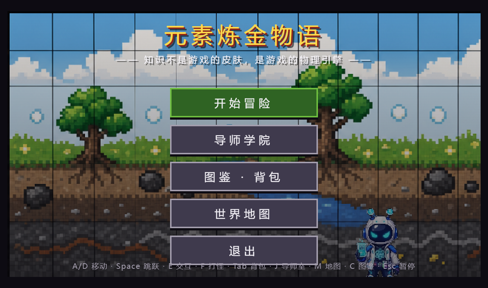
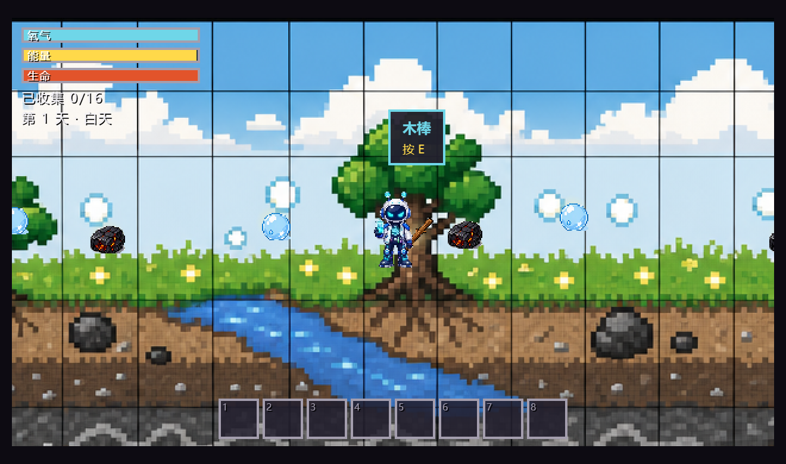
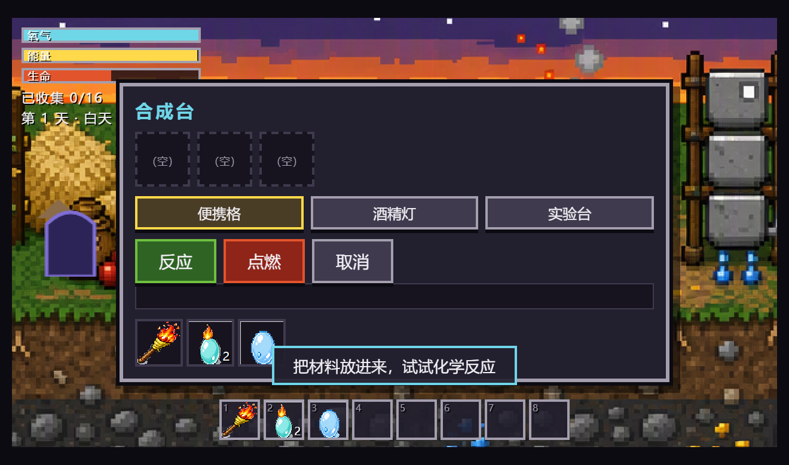
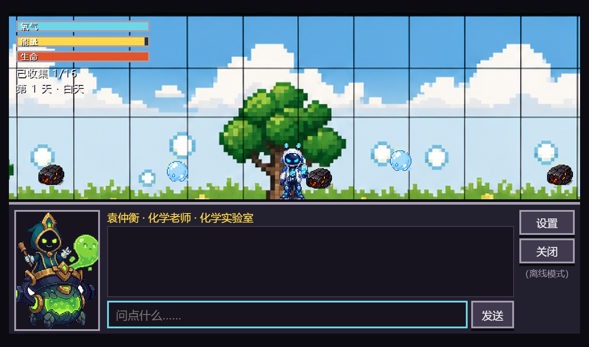
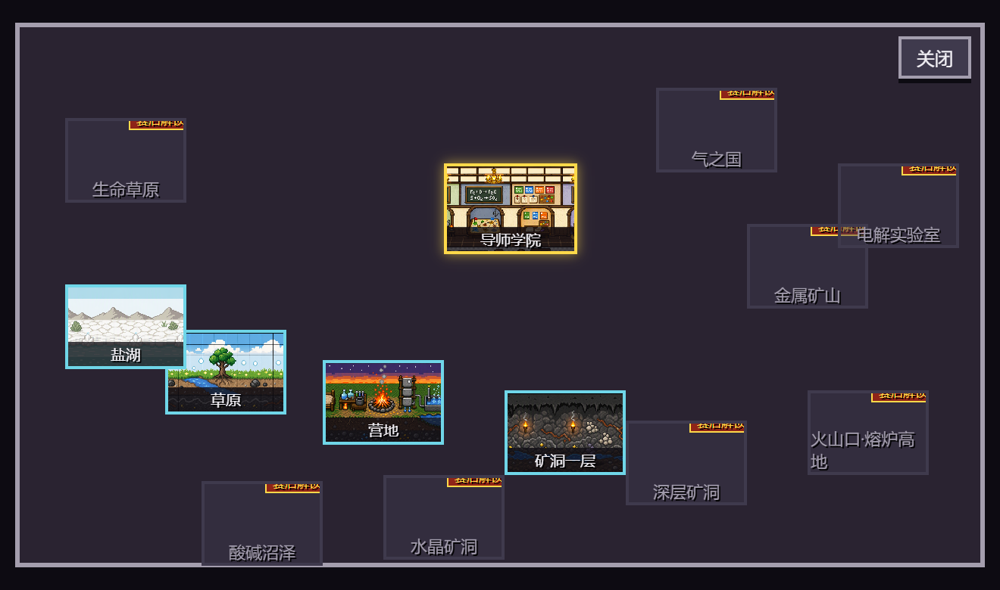
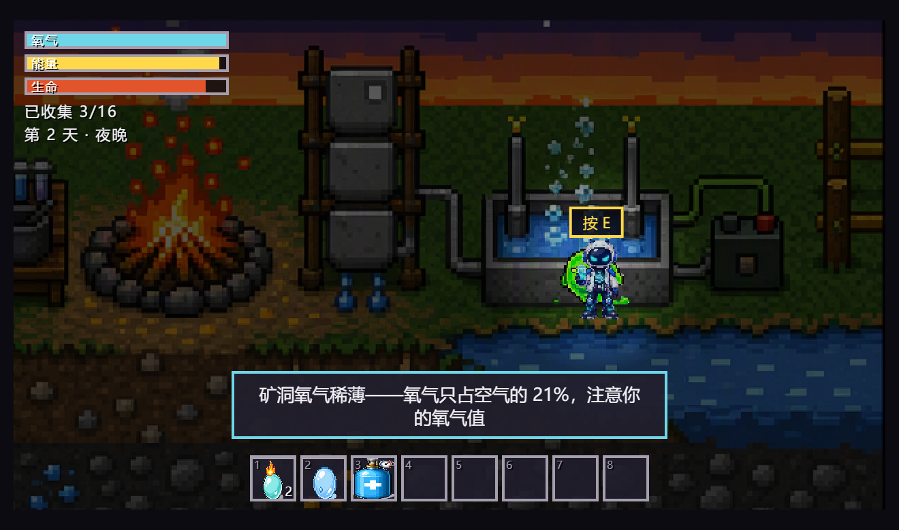

<div align="center">

# 🧪 MyElements · 网页版

**MyElements — 世界规则就是初中化学课本：没有魔法，只有化学。**

一款 2D 横版像素开放世界化学教育游戏：收集真实物质、按真实反应条件合成道具、靠化学知识生存，卡住就去「导师学院」问 4 位 AI 导师。


</div>

---

## 📖 目录

- [游戏截图](#-游戏截图)
- [核心玩法](#-核心玩法)
- [快速开始](#-快速开始)
- [操作指南](#-操作指南)
- [通关路径（10~15 分钟）](#-通关路径1015-分钟)
- [导师学院](#-导师学院)
- [数据驱动设计](#-数据驱动设计)
- [项目结构](#-项目结构)
- [测试与校验](#-测试与校验)
- [部署](#-部署)
- [素材与许可](#-素材与许可)

---

## 📸 游戏截图

| 主菜单 | 草原探索 | 氢气爆炸事件 |
|:---:|:---:|:---:|
|  |  |  |

| 导师问答 | 世界地图 | 矿洞之夜 |
|:---:|:---:|:---:|
|  |  |  |

---

## 🎮 核心玩法

> **草原收集 → 营地合成 → 氢气爆炸 → 导师问答 → 夜晚生存 → 睡觉复活**，10~15 分钟完整闭环。

- **🌬️ 三值生存系统**：氧气 / 饥饿 / 生命。矿洞等低氧区氧气加速消耗，需要电解水制氧气瓶续命
- **🧪 12 条真实化学配方**：每条都是初中课本原反应——硫燃烧、电解水、中和反应、湿法炼铜、灭火器原理、粗盐提纯……成功弹出知识卡片，失败给出化学反应级解释
- **💥 氢气验纯事件**：H₂+O₂ 未验纯直接点燃 → **爆炸 -50 HP**，经典课本实验的游戏化惩罚；去导师学院问清原理后解锁验纯
- **👻 化学驱怪**：CO 幽灵用活性炭砸（防毒面具原理）、酸雾怪用中和喷雾喷（酸碱中和），消耗品用一次少一个
- **🌙 昼夜循环**：夜晚怪物出没，硫火把照明；床睡觉跳夜并刷新资源，死亡掉落在死亡点可捡回
- **🏫 导师学院**：4 位具名 AI 导师 + 班主任统一调度，DeepSeek 在线回答，断网自动切 34 条本地兜底问答，**全程可离线通关**
- **🗺️ 世界地图**：13 大区域（草原/营地/盐湖/矿洞/导师学院已开放，火山口/气之国等 8 区剪影预告）
- **📒 图鉴收集**：17 种真实物质点亮图鉴，55 条知识字幕随探索触发

---

## 🚀 快速开始

### 环境要求

| 工具 | 版本 | 用途 |
|---|---|---|
| Node.js | ≥ 18 | 开发服务器 / 构建 / 测试 |
| Python 3 | ≥ 3.9 | （可选）重新处理美术素材 |
| Chrome / Edge | 任意现代版本 | 冒烟测试（puppeteer-core 驱动） |

### 三步跑起来

```bash
npm install        # 1️⃣ 安装依赖
npm run dev        # 2️⃣ 启动开发服务器 → http://localhost:5173
npm run build      # 3️⃣ 构建静态产物到 dist/（部署用）
```

> `dev` 与 `build` 前会自动执行 `sync_public.mjs`，把 `data/` 数据表同步进 `public/`，无需手动拷贝。

### 全部脚本一览

| 命令 | 作用 |
|---|---|
| `npm run dev` | Vite 开发服务器（热更新） |
| `npm run build` | 构建生产包到 `dist/` |
| `npm run preview` | 本地预览构建产物 |
| `npm run test` | Vitest 单元测试（90 条断言） |
| `npm run validate` | 数据表 10 类完整性校验（通过输出 `DATA OK`） |
| `npm run smoke` | 浏览器冒烟：菜单/移动/拾取/各面板/console 零错误 |
| `npm run smoke2` | 深度冒烟：核心闭环 29 项功能自动检查 |
| `npm run assets` | （可选）重新切图/生成图标/拷贝音乐 |

---

## ⌨️ 操作指南

| 按键 | 功能 |
|---|---|
| `A` / `D` 或 `←` / `→` | 移动 |
| `Space` | 跳跃 |
| `E` | 交互（拾取 / 设施 / 区域穿梭 / 提问 / 睡觉） |
| `F` | 打怪 —— 自动选用克制物品：活性炭砸幽灵、中和喷雾喷酸雾怪 |
| `Tab` | 背包 |
| `J` | 导师指导室 |
| `M` | 世界地图（13 区域） |
| `C` | 图鉴 |
| `1`–`8` | 快捷栏使用 / 交易卖出 |
| `Esc` | 暂停 / 关闭面板 |

---

## 🗺️ 通关路径（10~15 分钟）

1. **草原**：捡 O₂、C、木棒 —— 头顶弹出知识字幕，图鉴点亮
2. **盐湖**：捡粗盐，用肥皂水试湖水（硬水现象）；回营地实验台做**粗盐三步提纯**（溶解→过滤→蒸发）得 NaCl
3. **营地河边**：取水 → 过滤器（净水四步）→ 电解器 → 得 H₂/O₂ 和氧气瓶
4. **矿洞**：采 S、CaCO₃、Fe、Fe₂O₃ —— 氧气加速消耗，小心 CO 幽灵，CuSO₄ 溶液池别泡
5. **合成台**：木棒 + 硫 → **硫火把**（解锁知识卡片）
6. **氢气事件**：H₂+O₂ 未验纯点燃 → 💥 爆炸 -50 → 去导师学院问"为什么氢气会爆炸"（班主任苏婉清首接并 @化学老师）→ 解锁验纯 → 验纯后点燃成功
7. **夜晚生存**：火把照明、中和喷雾打酸雾怪、活性炭砸 CO 幽灵（戴口罩可免疫 CO）
8. **睡觉复活**：床睡觉跳夜（资源刷新）；死亡掉落物留在死亡点可捡回
9. **原住民交易**：收购你的装备换能量（+20）

---

## 🏫 导师学院

4 位具名 AI 导师，班主任统一调度，问题按关键词路由：

| 导师 | 身份 | 专长 | 口头禅 |
|---|---|---|---|
| **苏婉清** | 班主任（45 岁，传奇冒险家） | 一切问题首接，判断类型并 @ 对应老师 | "别慌，这件事我来安排。" |
| **袁仲衡** | 化学老师（57 岁，退休院士） | 方程式必配平、必标条件，外冷内热 | "配平了吗？" |
| **曲嫣然** | 实用思维老师（32 岁，前材料工程师） | 学习方法 + 怪物应对的元素思维 | "有趣，再想想。" |
| **周启明** | 助理（25 岁，袁老师关门弟子） | 把目标拆成 2~4 步闯关攻略 | "今天只做这一格，做到了就算赢。" |

### 🔌 联网与离线

- **默认离线模式**：全流程可完整体验，回答带「（离线模式）」标记（34 条本地兜底问答 + 班主任调度链）
- **联网模式**：聊天框「设置」里填入 DeepSeek API key 即走在线回答
- **隐私**：key 只存在你自己浏览器的 localStorage，不进任何文件、日志与 git

---

## 📊 数据驱动设计

**改内容不改代码**——全部文案、数值、配方、人设都在 `data/*.json`（10 张表）：

| 数据表 | 内容 | 规模 |
|---|---|---|
| `substances.json` | 真实物质（氧气、氢气、粗盐、硫酸铜……） | 17 种 |
| `items.json` | 道具（硫火把、中和喷雾、氧气瓶……） | 9 种 |
| `recipes.json` | 化学配方（方程式 + 知识卡片 + 条件） | 12 条 |
| `mentors.json` | 导师人设 / system prompt / 调度关键词 | 4 位 |
| `tips.json` | 知识字幕 | 55 条 |
| `qa_fallback.json` | 离线兜底问答 | 34 条 |
| `worldmap.json` | 世界区域（5 开放 + 8 预告） | 13 区 |
| `balance.json` | 数值调参（三值、伤害、LLM 参数） | 9 组 |
| `ui_strings.json` | 界面文案 | 全量 |
| `fail_messages.json` | 失败解释文案 | 全量 |

---

## 📁 项目结构

```
web/
├── index.html              # 入口
├── src/
│   ├── main.ts             # 启动引导
│   ├── core/               # 游戏管理器 / 事件总线 / 配方引擎 / LLM 客户端 / 数据加载
│   ├── world/              # 玩家 / 地图 / 怪物 / 交互物 / 精灵工厂
│   ├── gameplay/           # 背包 / 物品效果 / 氢气事件 / 粗盐提纯 / 发现系统
│   ├── mentor/             # 导师路由 / 输入清理 / prompt 后缀 / 离线兜底
│   ├── ui/                 # HUD / 聊天面板 / 各类面板 / 字幕层
│   ├── scenes/             # 启动 / 菜单 / 世界三大 Phaser 场景
│   ├── save/               # localStorage 存档
│   ├── audio/              # 音效合成
│   └── gen/                # 生成的精灵帧数据
├── data/                   # 10 张 JSON 内容数据表（单一事实来源）
├── public/                 # 静态资源（构建时由 data/ 自动同步）
├── scripts/                # 素材处理 / 数据校验 / 浏览器冒烟脚本
│   └── _shots/             # 自动截图（本 README 的配图来源）
└── tests/unit/             # Vitest 单元测试
```

**技术栈**：TypeScript + Phaser 3（世界渲染）+ DOM UI（面板）+ Vite 构建 + Vitest 测试。

---

## ✅ 测试与校验

```bash
npm run test             # Vitest 单元测试（90 条：配方引擎/背包/字幕/三值/导师调度/LLM 兜底）
npm run validate         # 数据表 10 类校验（输出 DATA OK）
node scripts/smoke.mjs   # 浏览器冒烟：菜单/移动/拾取/各面板/console 零错误
node scripts/smoke2.mjs  # 深度冒烟：核心闭环 29 项功能检查
```

冒烟脚本基于 puppeteer-core 驱动真实浏览器，自动注入按键、走完整闭环并截图到 `scripts/_shots/`。

---

## 🌐 部署

构建产物是**纯静态文件，零服务端依赖**：

```bash
npm run build        # 产出 dist/
```

把 `dist/` 整个目录放到任意静态服务器即可：**GitHub Pages / itch.io / Netlify / Nginx / OSS**，打开 URL 即玩，首次加载后断网仍可离线游玩（导师走本地兜底）。

---

## 🎨 素材与许可

- **角色 / 导师 / 怪物 / 地图 / 音乐**：项目自有素材（`my chest资料库/`）
- **图标 / 占位图**：程序化生成（`scripts/process_assets.py`）
- **原住民 NPC**：程序化像素绘制
- 代码与内容数据表版权归属项目作者所有

---

<div align="center">

**与 Godot 桌面版共用同一套内容源** · 仓库根目录见 [../README.md](../README.md)

Made with 🧪 & ❤️ — 没有魔法，只有化学

</div>
